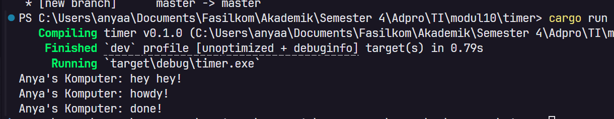
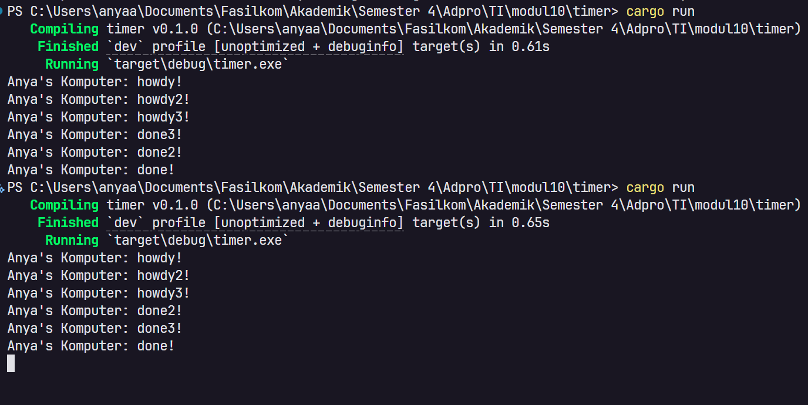

# Reflection

Anya Aleena Wardhany

2406401773

## Experiment 1.2: Understanding How It Works



Setelah menambahkan `println!("Anya's Komputer: hey hey!")` tepat setelah `spawner.spawn(...)`,
outputnya adalah:

```
Anya's Komputer: hey hey!
Anya's Komputer: howdy!
Anya's Komputer: done!
```

"hey hey!" muncul sebelum "howdy!" meskipun kode `spawn` ditulis lebih dulu. Ini terjadi karena `spawner.spawn()` hanya mendaftarkan future ke dalam queue, bukan langsung menjalankannya. Future baru benar-benar dieksekusi saat `executor.run()` dipanggil. Jadi baris `println!` yang ada di luar async block akan langsung dieksekusi oleh main thread, sedangkan isi async block (howdy! dan done!) baru dijalankan oleh executor setelahnya.


## Experiment 1.3: Multiple Spawn and Removing Drop

### Multiple Spawn



Ketika `spawner.spawn()` dipanggil 3 kali, outputnya adalah:

```
Anya's Komputer: howdy!
Anya's Komputer: howdy2!
Anya's Komputer: howdy3!
Anya's Komputer: done3!
Anya's Komputer: done2!
Anya's Komputer: done!
```

Ketiga "howdy" muncul berurutan terlebih dahulu, baru kemudian "done" muncul dalam urutan terbalik. Ini karena ketiga future dijalankan secara **concurrent**, executor menjalankan semua task secara bergantian. Ketiga task mulai timer hampir bersamaan, dan ketika timer selesai, task yang terakhir didaftarkan justru selesai lebih dulu karena thread scheduling.

### Removing drop(spawner)

Ketika `drop(spawner)` dikomentari, program **tidak pernah selesai** (hang). Ini karena `executor.run()` menggunakan `recv()` yang akan terus menunggu task baru dari channel. `drop(spawner)` berfungsi untuk menutup sisi pengirim channel, sehingga executor tahu tidak akan ada task baru dan bisa berhenti. Tanpa `drop`, executor menunggu selamanya karena channel tidak pernah ditutup.

Jadi:
- **Spawner** bertugas mendaftarkan/mengirim future ke dalam queue
- **Executor** bertugas menjalankan future-future tersebut
- **drop(spawner)** memberi sinyal bahwa tidak ada lagi task yang akan dikirim, sehingga executor bisa berhenti setelah semua task selesai